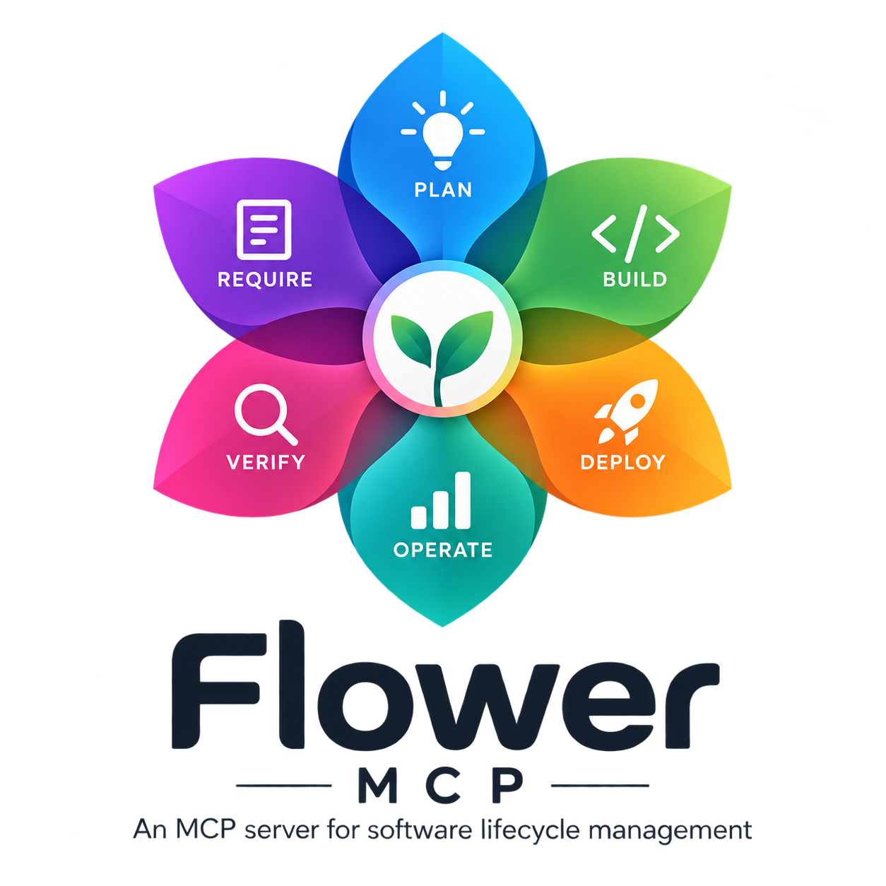

# Flower MCP

<p align="center">
  
</p>

Version: `0.1.1` · License: `Apache-2.0` · Python: `3.11+`

Flower MCP gives coding agents a persistent software lifecycle: requirements,
goals, milestones, changes, implementation plans, findings, verification,
acceptance and handover. It keeps project state in a SQLite ledger while your
coding agent investigates repositories, writes code and reports outcomes.

Core works without CodingCastle, LM Studio or an internal model. Integration
providers and internal inference are optional. The command is `flower-mcp`;
the Python distribution retains the name `flow-of-work-mcp`, the import package
`flow_of_work_mcp` and the existing `fow_*` MCP tools.

## Installation

Flower MCP is currently in testing. Release `v0.1.1` includes installers, a
wheel and a source archive. Choose the route for your operating system below.
Automatic installers use public GitHub release downloads. If access is restricted,
use an authorized clone or manually downloaded wheel; downloading an installer
with an authenticated browser does not authenticate its subsequent downloads.

| Operating system | Implemented installation routes | Verification so far |
| --- | --- | --- |
| macOS | Bash release installer, manual source/wheel, Python release installer | Installed package and public MCP workflow verified locally |
| Linux | Bash release installer, manual source/wheel, Python release installer | Installed wheel and MCP smoke verified in Ubuntu CI on Python 3.11–3.14; anonymous Linux release-installer run remains pending |
| Windows | PowerShell release launcher, manual source/wheel and Python release installer | PowerShell 5.1 helpers and installed-wheel public MCP behavior checked in CI; target workstation/client test remains separate |

Release `v0.1.1` includes the Windows launcher as `install.ps1`, covered by
`SHA256SUMS`. All automatic installation commands below select that same version.

### Prerequisites

These prerequisites cover core installation. Choose one route; its requirements differ:

- **Bash release installer (macOS/Linux):** Bash, `curl`, `awk`,
  `sha256sum` or `shasum`, standard shell utilities, trusted HTTPS certificates
  and Internet access. Python is prepared automatically when no suitable
  interpreter is available.
- **PowerShell launcher (Windows):** Windows PowerShell 5.1+ and Internet access.
  It reuses Python 3.11+ when available or prepares managed Python when missing.
  Git and curl are unnecessary.
- **Manual source/wheel installation or the Python release installer:** Python
  **3.11 or newer** with `venv`, `ensurepip` and SSL support. Creating the venv
  supplies its `pip`. Git is needed only to clone the source; a downloaded wheel
  and the Python release installer do not require Git or `curl`.
- **Agent registration:** have the selected Codex, Claude Code or Cursor client
  installed. Flower does not install the client. You can install Flower first
  and configure a client later.

Use a writable user directory. Flower itself installs into a virtual environment;
system package-manager commands used to obtain prerequisites may need administrator
permission. Follow the [prerequisite setup guide](docs/INSTALLATION.md#prerequisites)
for macOS, Linux and Windows, including installation of `curl`, Python and Git.

### Automatic installation on macOS/Linux

Check your shell and downloader first:

```sh
bash --version
curl --version
```

If `curl` is missing on Ubuntu/Debian, install it before using the download command:

```sh
sudo apt update
sudo apt install curl ca-certificates
```

Other Linux package managers and macOS alternatives are in the
[prerequisite setup guide](docs/INSTALLATION.md#prerequisites).
The Linux package-manager commands follow the
[curl installation guide](https://everything.curl.dev/install/linux.html).

With release assets publicly accessible:

```sh
curl -fsSL https://github.com/Damel91/flower-mcp/releases/download/v0.1.1/install.sh | bash
```

The installer prepares an isolated Python environment, obtains Python when
needed, verifies release downloads and lets you choose Codex, Claude Code,
Cursor or installation without registration. It does not authenticate private
GitHub downloads.

### Manual installation from source

Have Git and Python 3.11+ installed. Run each step separately and stop if it fails.
While the repository is private, cloning requires authorized GitHub access.

**macOS/Linux:**

```sh
python3 --version
git --version
git clone https://github.com/Damel91/flower-mcp.git
cd flower-mcp
python3 -m venv .venv
.venv/bin/python -m pip install .
.venv/bin/python -m pip check
.venv/bin/flower-mcp install --platform codex --dry-run
.venv/bin/flower-mcp install --platform codex
.venv/bin/flower-mcp doctor --platform codex
```

**Windows, in PowerShell (implemented route; native verification pending):**

```powershell
py -3 --version
git --version
git clone https://github.com/Damel91/flower-mcp.git
cd flower-mcp
py -3 -m venv .venv
& .\.venv\Scripts\python.exe -m pip install .
& .\.venv\Scripts\python.exe -m pip check
& .\.venv\Scripts\flower-mcp.exe install --platform codex --dry-run
& .\.venv\Scripts\flower-mcp.exe install --platform codex
& .\.venv\Scripts\flower-mcp.exe doctor --platform codex
```

The selected interpreter must report Python 3.11 or newer. Use a version selector
such as `py -3.12` consistently if your default Python 3 is older.
These commands use the venv executables directly; no activation or PowerShell
execution-policy change is needed.

Use `claude-code` or `cursor` instead of `codex` for another client. Then reload
that client and follow its connection/trust prompt. `doctor` inspects files; it
does not prove an MCP connection.

### Automatic Windows installation with PowerShell

The script is [tools/install.ps1](tools/install.ps1). If you already have the
repository, run it from the repository root without downloading another copy:

```powershell
powershell.exe -NoProfile -ExecutionPolicy Bypass -File .\tools\install.ps1 -Platform codex
```

Download the version-pinned release launcher and run it in a dedicated PowerShell process:

```powershell
Invoke-WebRequest -UseBasicParsing -Uri "https://github.com/Damel91/flower-mcp/releases/download/v0.1.1/install.ps1" -OutFile ".\install.ps1"
powershell.exe -NoProfile -ExecutionPolicy Bypass -File .\install.ps1 -Platform codex
```

Use `-Platform claude-code`, `-Platform cursor`, or `-NoRegister` instead. The
execution-policy option applies only to this process. The script verifies the
pinned Python backend before execution, reuses the canonical installer and
prepares managed Python 3.11 when necessary. It does not install the coding client.

The default installation environment is `%LOCALAPPDATA%\Flower MCP Install\venv`;
persistent profiles and ledgers live separately in `%LOCALAPPDATA%\Flower MCP`.
Reload the selected client and follow its connection/trust prompt. The target
Windows workstation and client experience remain to be tested. The
[CI workflow](https://github.com/Damel91/flower-mcp/actions/workflows/ci.yml)
checks the launcher helpers and the current installed wheel, bootstrap and
public MCP workflow on Windows. Release-download installation, managed Python
preparation when Python is missing and
coding-client connections remain unverified on Windows.

### Manual wheel installation

You can instead download the wheel and `SHA256SUMS` from the
[release](https://github.com/Damel91/flower-mcp/releases/tag/v0.1.1), compare the
wheel's SHA-256 with its manifest entry, create a venv and install that local wheel.
See the complete [macOS/Linux and Windows wheel commands](docs/INSTALLATION.md#manual-installation-from-a-release-wheel).

The release's `install_flower.py` is also available if Python 3.11+ is already
installed. See [installation](docs/INSTALLATION.md) for prerequisite setup,
launcher options, bootstrap commands, profiles, upgrades, removal and recovery.

## Using Flower

For a scenario-led introduction, choose [English](docs/presentation/eng/README.md)
or [Italiano](docs/presentation/ita/README.md). Both editions follow one project
through the six lifecycle petals, with a public-tool map and a matching offline
HTML reader. The [presentation index](docs/presentation/README.md) links both.

Ask your coding agent to run `flower-mcp bootstrap` and follow the output to
update the current project's `AGENTS.md`, preserving its existing rules.
The instructions are bundled with the installed package and also supplied as
`BOOTSTRAP.md` in each release. Its persistent agent template includes progressive
scenario-first dialogue, autonomous technical investigation, complete plan gates,
semantic correction and honest progress reporting. See [agent bootstrap](docs/BOOTSTRAP.md) for a
ready-to-use model request and the connection/project-selection steps.

Begin with `fow_interaction`, using a fresh host-owned interaction reference,
and select the intended lifecycle project explicitly. `fow_capabilities`
describes the available operations and engineering recipes; `fow_handover`
returns durable project state and the next gate.

Flower records lifecycle authority and evidence provenance. External plans
expose ordered instructions, dependencies and checks through `fow_external_work`.
Exported Markdown plans can be executed by your coding agent while Flower is
offline, then reconciled against the declared revision when it returns.
Completion, verification and human acceptance are separate states.

`fow_bindings` manages project associations. `fow_semantic` supports preparation,
validation and adoption of semantic results, including host-produced results
without an internal model. Inspect each operation's current prerequisites.

Profiles, client configuration and runtime databases are stored outside the
package. One process owns each ledger; use separate profiles for independent
client sessions. You can start the stdio server directly with `flower-mcp serve`.

## Releases

Release `v0.1.1` contains a wheel, a source archive, `install.sh`, `install.ps1`,
`install_flower.py`, `BOOTSTRAP.md` and `SHA256SUMS`. The source archive includes
the bilingual presentation and offline reader. See [version notes](docs/RELEASE-NOTES-0.1.1.md).
The repository includes the installer source and the build/publish workflow. See [releasing](docs/RELEASING.md) for
versioning and the explicit publication procedure.

## License and attribution

Flower MCP is licensed under the [Apache License 2.0](LICENSE).
[NOTICE](NOTICE) credits Flower MCP and copyright holder Davide Mele.
Both files are included in source and wheel distributions.
