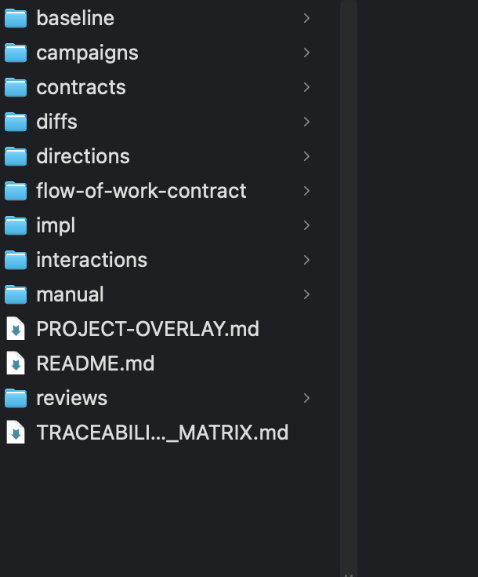
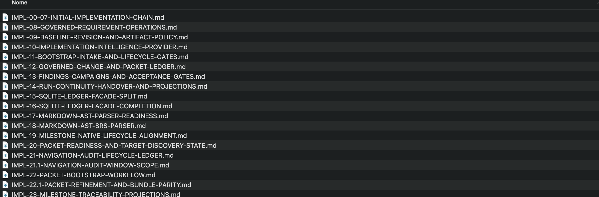
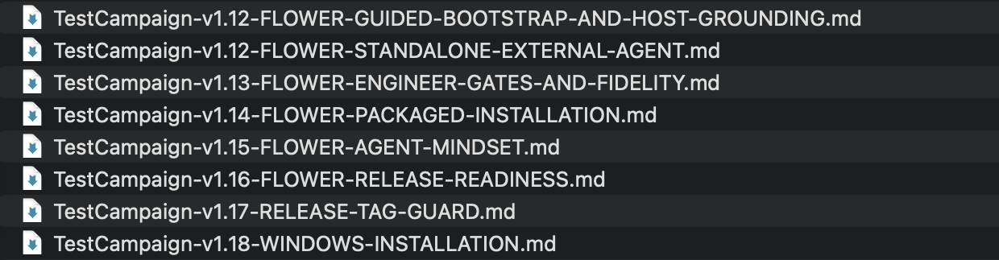

# Come ho costruito Flower MCP

[Indice](README.md) · [Confronto tra plane](comparison.md) · [Fonti e limiti](sources.md)

> «Ho un lavoro e non ho scritto personalmente una riga di codice di questo
> progetto. Ho progettato il sistema, discusso i requisiti, guidato gli agenti e
> deciso che cosa verificare, correggere e accettare.»

Questo è il racconto del metodo dell'autore, non un benchmark di autonomia.
Delegare la scrittura del codice non ha eliminato il lavoro di ingegneria:
ha spostato il mio contributo verso intenzione, architettura, vincoli e verifica.

## Esperimenti personali e apprendimento

Flower MCP, il framework documentale e il componente sperimentale di coding
sono **esperimenti personali**, nati per acquisire competenze di sviluppo con
nuove tecnologie emergenti. Esploro in particolare coding agent, protocollo MCP,
modelli locali e metodi per governare e verificare il software prodotto con il
loro aiuto.

Sono progetti distinti dalla mia attività professionale. La pubblicazione
condivide il metodo e quanto è utilizzabile di questa ricerca personale; non
rappresenta un prodotto o un'attività del mio datore di lavoro.

## Gli strumenti e il tempo

| Aspetto | Come ho lavorato |
| --- | --- |
| Coding agent principale | **Codex**, con modelli diversi nel corso del progetto. |
| Il mio ruolo | Progettazione, confronto sulle scelte, revisione dei risultati e decisioni di accettazione. |
| Il ruolo degli agenti | Lettura del codice, pianificazione tecnica, implementazione, test e aggiornamento dei documenti. |
| Tempo dedicato al server | **Circa due mesi di sviluppo concentrato**, realizzato dopo l'orario di lavoro. |
| Contesto più ampio | Una ricerca iniziata prima e tuttora in corso sugli agenti di coding e sui modelli locali. |

Ho sviluppato i progetti nel mio tempo personale, dopo l'orario di lavoro.
Ho mantenuto separate l'attività professionale e questa ricerca, anche per
ambito di applicazione.

La durata è un'indicazione dell'autore: non un conteggio di ore lavorate, né il
tempo complessivo della ricerca. La copia pubblica è stata preparata alla fine
del percorso; la sua data di creazione su Git non coincide con l'inizio dello
sviluppo. Non attribuisco il risultato a una singola versione di un modello.

## Prima del server, il plane documentale

Flower non è nato chiedendo a un agente di «costruire un server MCP» in una sola
conversazione. Il lavoro era governato da un **plane documentale**: documenti
collegati che distinguevano requisiti, decisioni, cambiamenti, pacchetti di
implementazione, review, finding e campagne di test.

[](../assets/method-authorities.png)

*Ritaglio dell'organizzazione documentale adottata. Mostra le categorie, non il
contenuto dei documenti.*

Il loop era concreto:

1. chiarire il comportamento atteso e i suoi limiti;
2. registrare il cambiamento nei requisiti e progettare una catena di lavoro;
3. affidare all'agente pacchetti con azioni, dipendenze e controlli;
4. esaminare il risultato con test deterministici e campagne live quando pertinenti;
5. registrare i problemi, correggerli e decidere che cosa accettare;
6. mantenere distinti i commit documentali e quelli di implementazione.

[](../assets/method-plan.png)

*I piani erano artefatti persistenti, non soltanto messaggi da ricordare nella chat.*

[](../assets/method-campaigns.png)

*L'esistenza di un documento di campagna non prova che ogni test sia passato:
l'esito richiede le relative evidenze e decisioni, qui non pubblicate.*

## Perché questa metodologia

Con sessioni di lavoro discontinue non volevo ricominciare ogni volta spiegando
che cosa fosse stato deciso. E non volevo che una risposta convincente
dell'agente diventasse automaticamente una modifica accettata.

Il plane mi permetteva di riprendere da un obbligo preciso, distinguere un bug
da un requisito nuovo e confrontare il risultato con l'intento iniziale. La
disciplina documentale aggiunge lavoro, ma rende contestabili le decisioni e
recuperabile lo stato anche quando cambia la chat o il modello.

**Flower trasferisce parte di questa disciplina dal documento al server:** stato,
revisioni, piani, evidenze e passaggi di consegna possono essere interrogati
attraverso tool. Non significa che Flower sia stato usato, già completo, per
produrre sé stesso o che sostituisca il giudizio dell'ingegnere.

## Quanto codice c'è oggi

| Misura della copia pubblica | Valore al 3 ottobre 2026 |
| --- | --- |
| File Python di produzione in `src/flow_of_work_mcp` | **171** |
| Righe fisiche negli stessi file | **74.586** |
| Incluso nel conteggio | Codice, commenti, docstring e righe vuote. |
| Escluso dal conteggio | Test, tool di sviluppo, documentazione, reader generato e repository private. |

Il conteggio riguarda il sorgente presente, non tutte le righe prodotte e poi
riscritte durante lo sviluppo. Non misura qualità, complessità utile o ore
risparmiate. La revisione di prodotto è quella dichiarata in [Fonti e limiti](sources.md).

Da un checkout di quella revisione, il conteggio è riproducibile:

```sh
git ls-files -- 'src/flow_of_work_mcp/*.py' | wc -l
git ls-files -z -- 'src/flow_of_work_mcp/*.py' | xargs -0 wc -l | tail -n 1
```

## Una ricerca più ampia, senza confondere i prodotti

Sto realizzando anche un **coding agent sperimentale per modelli locali**.
L'obiettivo di ricerca è capire quanto lavoro si possa affidare a modelli più
piccoli delimitando meglio contesto, compiti e verifiche. Non è una capacità
garantita da questa release di Flower, né una promessa di autonomia già raggiunta.

Flower è la parte pubblica dedicata al ciclo di vita del software, utilizzabile
con coding agent diversi. Gli altri componenti sperimentali, i loro dettagli
interni e le campagne sui modelli non fanno parte di questa pubblicazione.

## Che cosa non pubblico ancora

Il [framework documentale generale](https://github.com/Damel91/LLMs-flow-of-work)
è distinto dall'istanza effettivamente adottata per questo progetto. **Il plane
di progetto completo resta privato**: contiene dati personali e materiali interni,
e la sua sanificazione non è ancora stata pianificata.

Questa pagina pubblica solo tre ritagli locali degli elenchi, senza desktop,
barre laterali, percorsi personali o contenuti dei file. Gli screenshot originali
non fanno parte della presentazione o del pacchetto distribuito. I ritagli
illustrano il metodo; non sostituiscono un audit della storia privata.

[Indice](README.md) · [Come questo metodo diventa Plan](02-plan.md)
